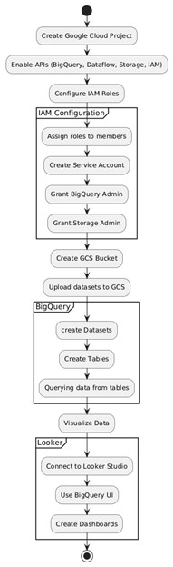

# FreightFlow Optimizer 🚚

This repository contains the code, data, and analysis for a case study on optimizing shipping logistics and supply chain routes. The goal of this project was to analyze shipping data to satisfy operational constraints while minimizing freight and warehousing costs.

This project was developed using **Google Cloud Platform (GCP)**, leveraging services like Google Cloud Storage (GCS), Dataflow, BigQuery, and Looker Studio to build an end-to-end data analysis pipeline.

---

## 🛠️ Tech Stack & Methodology

The entire workflow was orchestrated on GCP to handle large-scale data processing and analysis:

* **Data Lake:** **Google Cloud Storage (GCS)** was used to store the 7 raw CSV datasets.
* **ETL Pipeline:** **Google Cloud Dataflow** automated the ingestion of data from GCS into BigQuery tables.
* **Data Warehouse:** **Google BigQuery** served as the central platform for data storage and SQL-based analysis.
* **BI & Visualization:** **Looker Studio** was connected to BigQuery to create interactive dashboards and visualize the findings.

### Project Flowchart


---

## 📊 Dataset Overview

The analysis is based on a dataset comprising seven interconnected tables, modeling a single day of logistics operations:

1.  **OrderList**: The central table containing over 9,000 customer orders.
2.  **FreightRates**: Contains shipping options, constraints, and costs.
3.  **PlantPorts**: Defines valid shipping routes between warehouses and ports.
4.  **ProductsPerPlant**: Specifies which products can be fulfilled by each warehouse.
5.  **VmiCustomers**: Lists special customers tied to specific warehouses.
6.  **WhCapacities**: Defines the daily order processing capacity of each warehouse.
7.  **WhCosts**: Contains the storage cost per unit for each warehouse.

---

## 🚀 How to Use This Repository

To replicate this analysis, follow these steps:

1.  **Clone the Repository:**
    ```sh
    git clone [https://github.com/gayathry-148/FreightFlow-Optimizer.git](https://github.com/gayathry-148/FreightFlow-Optimizer.git)
    ```
2.  **Set up GCP:**
    * Create a new GCP project.
    * Enable the APIs for GCS, BigQuery, and Dataflow.
    * Configure the necessary IAM roles (e.g., BigQuery Data Owner, Storage Object Admin).
3.  **Upload Data:**
    * Create a GCS bucket.
    * Upload the 7 CSV files from the `/data` directory into the bucket.
4.  **Load Data into BigQuery:**
    * Create a new BigQuery dataset.
    * Use the BigQuery UI or a Dataflow template ("CSV Files to BigQuery") to load each CSV file into its own table within the dataset.
5.  **Run Analysis:**
    * Navigate to the BigQuery console.
    * Open and run the queries from the `/sql_queries` directory to perform the analysis.
6.  **Visualize Results:**
    * Connect Looker Studio to your BigQuery dataset and recreate the visualizations from the case study.

---

## 🔍 Key Findings & Insights

The analysis of 13 SQL queries yielded several key insights into the shipping operations:

* **Plant Dominance**: **PLANT03** is the primary logistics hub, handling the vast majority of orders (8,541) and shipping weight (~140K units).
* **Port Activity**: **PORT04** is the most critical shipping port, processing 98.1% of all orders (9,041).
* **Shipping Mode Efficiency**: **AIR** shipping is more cost-effective for bulk transport, handling significantly more weight at a much lower average rate ($1.18) compared to **GROUND** ($12.71).
* **Customer Behavior**: A small group of top-tier customers accounts for a large volume of repeat orders, with the leading customer placing 976 orders.

For a detailed breakdown of each query and its findings, please see the full case study in the `/report` directory.


